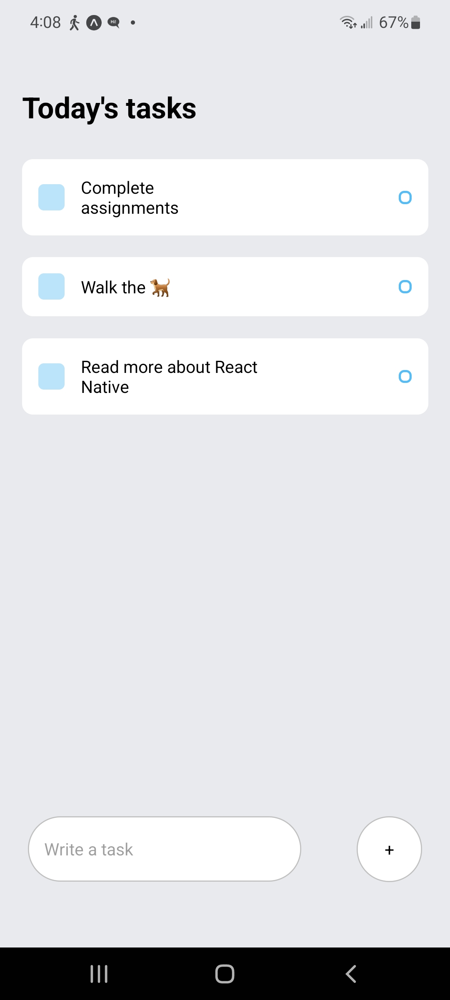

# A Completed Todo list app using React Native

A user may add to today's tasks list at the bottom where it says `Write a task` button, and then they can view all the tasks they have to complete. if the task is completed then just click on that task. After clicking, simply it will be deleted.

